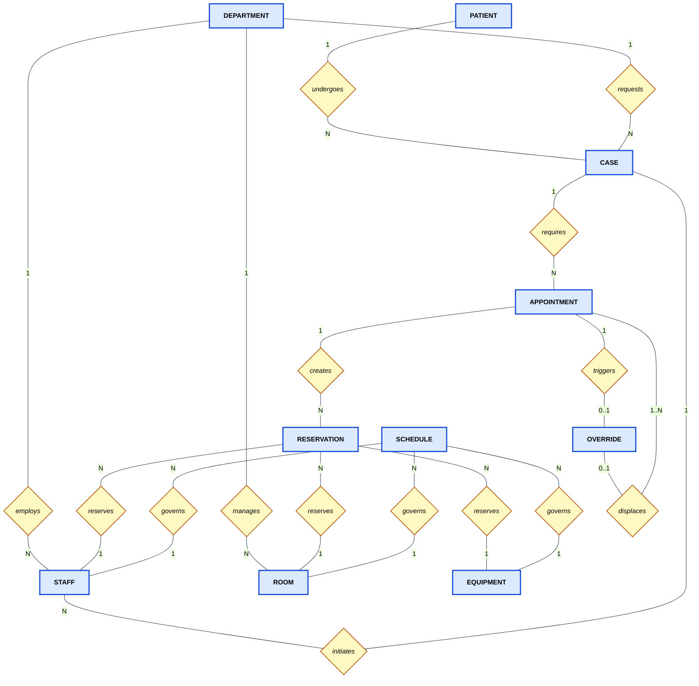

# OR Scheduling System — Project Blueprint
## Thai Government Hospital Operating Room Coordination Platform

> **Document Purpose:** This is the authoritative project blueprint for implementation.
> A new Claude Code session reading this document should have everything needed to
> produce a full implementation plan, database schema, and working prototype code.
> Read every section before generating any plan or code.

---

## PART 1 — BUSINESS CONTEXT

### 1.1 What Thai Government Hospitals Actually Look Like

Thailand's public hospital system operates under the Universal Coverage (UC) scheme,
which provides healthcare to approximately 75% of the population funded by general
taxation. The largest government hospitals — Siriraj (2,200+ beds, 3 million outpatients
annually, 61 specialty clinics), Ramathibodi (1,300+ beds, 5,000 outpatients per day,
16 ORs in one building alone), and King Chulalongkorn Memorial — function as national
referral centers. Patients from all over Thailand are referred upward to these institutions
for complex procedures.

These are teaching hospitals. The surgical teams include:
- **Attending surgeons** (อาจารย์แพทย์) — senior specialists who lead operations
- **Resident surgeons** (แพทย์ประจำบ้าน) — supervised trainees assisting in surgery
- **Anaesthesiologists** (วิสัญญีแพทย์) — dedicated, never shared mid-procedure
- **Scrub nurses** (พยาบาลห้องผ่าตัด) — instrument management inside the sterile field
- **Circulating nurses** — logistics outside the sterile field
- **OR coordinators** (เจ้าหน้าที่ประสานงาน) — the administrative schedulers per department

At Siriraj, the surgical complex has more than 60 operating rooms spread across multiple
buildings. Each OR is assigned to a specialty (orthopedics, cardiac, neurosurgery, etc.)
for scheduled blocks, but emergency cases can preempt any room. Ramathibodi's newer
Somdech Phra Debaratana building alone has 16 ORs and 14 ICUs operating as a single
integrated surgical complex.

### 1.2 The Actual Daily OR Scheduling Workflow (Current State)

Understanding the real workflow is critical to building a system that clinicians will
actually use. The current process in most Thai government hospitals works as follows:

**Step 1 — Surgical Decision (Ward Level)**
A surgeon on ward rounds examines a patient and decides the patient requires an operative
procedure. The surgeon writes this decision in the patient's chart and instructs the ward
nurse to arrange OR scheduling. This is informal — the note may say "schedule for
laparotomy, next available slot" or "urgent, needs OR within 48 hours."

**Step 2 — Coordinator Contact (Departmental Level)**
The ward coordinator (or the surgeon's secretary in larger departments) calls or walks to
the central OR desk. In many hospitals this still happens in person. The coordinator
states the department, the surgeon, the approximate procedure duration, and any special
equipment needs (C-arm fluoroscopy, laparoscopic tower, robotic system, etc.).

**Step 3 — The OR Desk Whiteboard (Current "System")**
The central OR desk maintains a large whiteboard (or a printed paper schedule updated
daily) showing room assignments for the day. An OR desk clerk looks at the whiteboard,
identifies a free slot, and verbally confirms or denies the request. If confirmed, the
clerk writes the case on the whiteboard: room number, time, department, surgeon name,
patient HN (Hospital Number from HOSxP), and procedure type.

**Step 4 — Staff Coordination (Informal, Parallel)**
Separately, the coordinator calls or messages (often via LINE — the dominant messaging
app in Thailand) the assigned anaesthesiologist and scrub nurse. The anaesthesiologist's
schedule is tracked by the anaesthesiology department independently, also on paper or
in a separate spreadsheet. There is no single system that shows staff and room
availability together.

**Step 5 — Equipment Reservation (Ad Hoc)**
Special equipment (C-arm, laparoscopic tower, robotic system) is reserved by a separate
call to the equipment room or biomedical department. There is no link between the OR
booking and the equipment reservation. The equipment coordinator writes the case in a
separate log book.

**Step 6 — Day-of Surgery (Paper Slip)**
On the morning of surgery, the patient receives a paper queue slip with their case
number. They are transported from the ward to the pre-operative holding area. The OR
desk runs off a printed master list for the day.

**Step 7 — Emergency Cases**
A trauma or emergency surgical case arriving at the ER goes through the senior surgeon
on call, who calls the OR desk directly. The OR desk clerk manually identifies which
elective cases can be bumped, calls the affected departments, updates the whiteboard,
and calls the anaesthesiologist, scrub nurse, and equipment room — all separately, all
verbally. This cascade of calls takes 15–45 minutes and is entirely dependent on whether
the right people answer their phones.

### 1.3 How HOSxP Fits (and Where It Stops)

HOSxP is the Hospital Information System used in over 300 Thai hospitals. It manages:
- Patient registration and demographics (HN assignment)
- Electronic health records, diagnosis coding (ICD-10)
- Prescription and pharmacy
- Lab results and imaging orders
- Billing and UC scheme claim submissions
- OPD (outpatient) appointment scheduling at the clinic level

HOSxP does **not** manage:
- OR scheduling or room assignments
- Surgical team scheduling
- Equipment reservation
- Real-time resource availability across departments
- Emergency preemption with audit trails

Our system operates **alongside** HOSxP, not as a replacement. We consume the patient's
HN from HOSxP as a reference identifier. We do not write back to HOSxP. We do not
attempt to integrate with HOSxP's database. This boundary is deliberate — HOSxP
integration requires hospital IT governance, schema access negotiations, and regulatory
approval. Our system is the scheduling coordination layer that HOSxP does not provide.

---

## PART 2 — THE PROBLEM

### 2.1 Four Failure Modes in the Current System

#### Failure 1: Collision (Room Double-Booking)
The whiteboard has no concurrency control. During the 07:00–09:00 morning rush, multiple
department coordinators call the OR desk simultaneously. An OR desk clerk verbally confirms
OR-4 to the orthopedics coordinator at 07:12. Before updating the whiteboard, a second
call arrives from neurosurgery for the same slot. A different OR desk clerk, looking at
the same un-updated whiteboard, confirms the same slot to neurosurgery at 07:14.

Two surgeons now believe they have OR-4. The conflict is discovered when both patients
arrive at the pre-operative holding area. One surgery is delayed by hours. The patient
who waited has been fasting since midnight.

This is not a hypothetical. **59% of OR time wastage in Thai hospitals is caused by
resource unavailability — rooms, staff, and equipment conflicts that are not discovered
until the day of surgery.**

#### Failure 2: Race Condition on Priority (No Guaranteed Preemption)
When an emergency trauma case arrives, the system's response time depends entirely on
human communication chains. The senior surgeon calls the OR desk. The OR desk clerk
looks at the whiteboard, decides which elective case to bump, calls that department's
coordinator, waits for acknowledgment, updates the whiteboard, then calls anaesthesiology,
then calls the equipment room.

This cascade takes 15–45 minutes. For a ruptured aortic aneurysm or traumatic brain
injury, these minutes are not administrative overhead — they are survival probability.

There is also no guarantee of consistent prioritization. Which elective case gets bumped
depends on which coordinator the OR desk clerk can reach, not on a principled urgency
scoring system. High-priority elective cases (cancer resections) can be displaced by
lower-urgency emergency cases because of who answers the phone first.

#### Failure 3: Queue Integrity Violation
The paper queue slip system has no integrity. A patient's slip can be:
- Lost (the patient loses their place in the queue with no recourse)
- Altered (slip number changed to cut the queue)
- Duplicated (two patients claim the same number)
- Destroyed (fire, water, paper degradation)

When a dispute occurs, there is no audit trail. The OR desk clerk's memory is the only
record. This creates an equity problem: patients with social connections can manipulate
the queue; patients without them cannot defend their legitimate position.

#### Failure 4: Data Loss and Non-Reproducibility
When a booking is changed, the whiteboard entry is erased and rewritten. The previous
state is permanently lost. There is no record of:
- Which department requested a slot and when
- Which staff member confirmed the booking
- Whether the case was cancelled, bumped, or completed
- How long each case actually took versus planned
- How often each surgeon runs overtime
- Equipment utilization rates per type

This makes performance improvement impossible. The hospital cannot answer "which
departments cause the most scheduling conflicts?" or "which equipment is the bottleneck?"
because there is no data.

### 2.2 The Database Root Cause of Each Problem

| Problem | Database Term | Root Cause |
|---------|--------------|------------|
| Room double-booking | Lost Update / Check-Then-Act Race | No atomic check-and-reserve on shared resources |
| Emergency delay | No Priority Enforcement | No transactional preemption mechanism |
| Queue slip fraud | No Audit Trail | No immutable record of state changes |
| No analytics | No Historical Data | Ephemeral whiteboard; no persistence |
| Staff/equipment conflict | No Concurrency Control | Reservations exist in separate, unlinked systems |

---

## PART 3 — THE PROPOSED SOLUTION

### 3.1 System in One Sentence

A real-time digital OR scheduling system where booking a surgery atomically reserves the
operating room, surgical team, and equipment in a single database transaction — all three
resources are committed together or none are, with full audit trail and live status
broadcast to all ward terminals simultaneously.

### 3.2 Core Design Principles

**Principle 1 — Atomicity over Convenience**
Every booking operation either fully succeeds or fully fails. There is no partial booking
state. A coordinator cannot reserve a room without simultaneously reserving staff and
equipment. This is enforced at the database transaction level, not at the application level.

**Principle 2 — Decentralized Resource Queues (ERP Pattern)**
Inspired by SAP PP/DS production scheduling: each resource type (Room, Staff, Equipment)
maintains its own queue of Reservations independently. This allows per-resource locking,
per-resource availability queries, and per-resource analytics without touching the master
Case or Appointment record. Two departments competing for the same room contend at the
Room's Reservation queue — not at a centralized scheduler.

**Principle 3 — Schedule as the Availability Contract**
A resource being "available" means two things: (a) it has a Schedule entry saying it
can be used during that window, AND (b) it has no overlapping Reservation. Querying only
Reservations without Schedules would allow booking a surgeon on their day off or
scheduling equipment during planned maintenance. Both checks are mandatory.

**Principle 4 — Override as a First-Class Entity**
Emergency preemption is not a deletion. The displaced elective Appointment is preserved
with status BUMPED. The emergency Appointment is created. An Override record links both,
records who authorized it, why, and when. This produces a full audit trail and allows
the OR desk to re-schedule all bumped cases systematically.

**Principle 5 — HOSxP as External Reference Only**
The patient's HN (Hospital Number) from HOSxP is stored as a string attribute on our
Patient entity. We do not query HOSxP in real time. We do not write to HOSxP. Patient
demographic data is copied once at Case creation for display resilience — if HOSxP is
unavailable, coordinators can still see the patient's name and HN on the scheduling board.

### 3.3 What the System Covers

- OR scheduling coordination across all surgical departments
- Real-time room, staff, and equipment availability checking
- Atomic multi-resource booking (room + surgeon + anaesthesiologist + equipment)
- Emergency case creation with automatic elective displacement
- Override authorization trail (who approved, why, when, what was displaced)
- Immutable audit log of every state change
- Live status broadcast to all connected ward terminals via WebSocket
- Analytics: OR utilization, equipment bottlenecks, cancellation rates, surgeon overtime
- Staff schedule management (working hours, on-call, leave)
- Equipment availability tracking including sterilization windows

### 3.4 What the System Explicitly Does Not Cover

- Clinical documentation, diagnosis, or treatment plans (HOSxP's domain)
- Billing, insurance claims, or DRG coding (HOSxP's domain)
- Pharmacy, lab orders, or prescriptions (HOSxP's domain)
- Multi-campus or multi-hospital scheduling (single-site only in v1)
- Consumables inventory (surgical kits, IV supplies) — only capital equipment
- Patient payment or financial workflow

---

## PART 4 — ENTITY-RELATIONSHIP DIAGRAM

### 4.1 Conceptual ER Diagram (Chen Notation)

```
The 10 entities and their relationships:

PATIENT ──[undergoes]──► CASE ◄──[requests]── DEPARTMENT
                          ▲
                     [initiates]
                          │
                        STAFF ◄──[employs]── DEPARTMENT
                          │
                       [governs]──► SCHEDULE ──[governs]──► ROOM ◄──[manages]── DEPARTMENT
                          │                                    │
                       [governs]                           [governs]
                          ▼                                    ▼
                      EQUIPMENT                           SCHEDULE

CASE ──[requires]──► APPOINTMENT ──[creates]──► RESERVATION
                          │                         │
                   [triggers]──► OVERRIDE      [reserves]──► ROOM
                                    │           [assigns]──► STAFF
                              [displaces]──►  [requisitions]──► EQUIPMENT
                              (1..N) APPOINTMENT
```

### 4.2 Mermaid Diagram (Render This)



---

## PART 5 — ENTITY DEFINITIONS

Each entity below describes: what it represents in business terms, its key attributes,
and critical design decisions that must be preserved in the physical schema.

### 5.1 PATIENT

**Business meaning:** A patient registered in the hospital system who requires a
surgical procedure. This is the human at the center of the system.

**Key attributes:**
- `patient_id` — internal UUID, primary key
- `hn` — Hospital Number from HOSxP (unique string, NOT a foreign key to HOSxP)
- `hosxp_ref` — full HOSxP patient identifier for cross-system reference
- `name` — full name (Thai), copied from HOSxP at Case creation
- `age` — integer
- `blood_type` — string enum
- `allergies` — text, free-form

**Critical design decision:** Patient data is copied from HOSxP once at Case creation.
We do not query HOSxP in real time. The `hn` field is our lookup key; if a patient
returns for a second procedure, we find them by `hn` and reuse the existing Patient row.

### 5.2 DEPARTMENT

**Business meaning:** An organisational unit within the hospital that employs surgical
staff, operates rooms, and requests OR scheduling on behalf of its patients. Examples:
ศัลยกรรมกระดูก (Orthopaedics), ศัลยกรรมหัวใจ (Cardiac Surgery), ประสาทศัลยศาสตร์
(Neurosurgery), วิสัญญีวิทยา (Anaesthesiology).

**Key attributes:**
- `department_id` — UUID, primary key
- `name` — department name (supports Thai)
- `building` — which building/floor (hospitals like Siriraj have multiple buildings)
- `head_of_department` — FK to Staff (for Override authorization)

**Critical design decision:** Department is the organizational owner of scheduling
requests (Cases). All race conditions arise from multiple Departments competing for
shared Resources. Department is therefore the unit of access control — a coordinator
can only initiate Cases for their own Department.

### 5.3 STAFF

**Business meaning:** Any hospital personnel involved in the surgical process:
surgeons, anaesthesiologists, scrub nurses, and OR coordinators. All are unified in
one entity differentiated by role — this prevents duplicating name, license, and
department attributes across multiple tables.

**Key attributes:**
- `staff_id` — UUID, primary key
- `name` — full name (Thai)
- `role` — enum: `SURGEON | ANAESTHESIOLOGIST | SCRUB_NURSE | COORDINATOR`
- `department_id` — FK to Department
- `license_number` — medical license (nullable for coordinators and nurses)
- `is_active` — boolean; deactivated staff cannot receive new Reservations

**Critical design decision:** No `available` boolean on Staff. Availability is a
time-range query: a Staff member is available if they have a Schedule entry covering
the requested window AND no overlapping Reservation exists. A boolean would be the
direct source of the lost-update race condition.

### 5.4 ROOM

**Business meaning:** A physical operating room, emergency theatre, or hybrid suite
within the hospital. Each Room is individually bookable and is managed by a primary
Department, though emergency cases can claim any Room regardless of departmental
assignment.

**Key attributes:**
- `room_id` — UUID, primary key
- `room_code` — short unique code: "OR-4", "ER-1", "HYBRID-2"
- `room_type` — enum: `OR | EMERGENCY | HYBRID`
- `department_id` — FK to Department (primary managing department)
- `is_laminar_flow` — boolean (some surgeries require positive pressure rooms)
- `is_active` — boolean

**Critical design decision:** No `available` boolean on Room. Same reasoning as Staff.
Availability is derived by checking Reservations and Schedules for time-range overlap.
The GIST exclusion constraint on Reservation prevents double-booking at the database
level regardless of application logic.

### 5.5 EQUIPMENT

**Business meaning:** An individual, serialised piece of capital medical equipment
that must be reserved for surgery. This is a specific physical unit — not a category.

Examples of equipment types:
- C-arm fluoroscopy machine (C-arm หมายเลข 1, C-arm หมายเลข 2)
- Laparoscopic tower
- Robotic surgical system (da Vinci)
- Ultrasound machine (intraoperative)
- Microscope (neurosurgery/ophthalmology)
- Cell saver (autologous blood recovery)

**Key attributes:**
- `equipment_id` — UUID, primary key
- `serial_number` — unique manufacturer serial
- `equipment_type` — string: "C-arm Fluoroscopy", "Laparoscopic Tower", etc.
- `status` — enum: `AVAILABLE | IN_USE | STERILIZING | MAINTENANCE | RETIRED`
- `sterilization_duration_minutes` — how long this unit needs between uses
- `last_sterilization_end` — timestamp; prevents booking before sterilization completes

**Critical design decision:** Individual units, not types, are reserved. If the
hospital has two C-arm machines, one may be in maintenance. Reserving "a C-arm" (type
level) would allow both reservations to claim the single working unit. Reserving
equipment_id="C-arm-001" forces the system to track each unit's availability
independently, which is the correct behaviour.

### 5.6 CASE

**Business meaning:** The clinical work order. A Case represents the decision that a
specific patient requires a specific surgical procedure. It is created by a surgeon
(initiates) on behalf of a Department (requests) for a Patient (undergoes). A Case
exists from the moment the surgical decision is made — before any scheduling has
occurred.

This is the ERP equivalent of a Production Order.

**Key attributes:**
- `case_id` — UUID, primary key
- `patient_id` — FK to Patient
- `department_id` — FK to Department
- `initiated_by` — FK to Staff (the surgeon who ordered the procedure)
- `procedure_type` — string: "Total Knee Replacement", "Laparoscopic Cholecystectomy"
- `urgency` — enum: `ELECTIVE | URGENT | EMERGENCY`
- `status` — enum: `OPEN | SCHEDULED | IN_PROGRESS | COMPLETED | CANCELLED`
- `clinical_notes` — free text: relevant patient conditions, allergies, special needs
- `estimated_duration_minutes` — surgeon's estimate
- `created_at`, `updated_at` — timestamps

**Critical design decision:** Case and Appointment are deliberately separate entities.
A Case can be rescheduled (new Appointment, same Case — the surgical decision has not
changed). A Case can require multiple Appointments (pre-op consultation, main surgery,
post-op procedure). Merging Case and Appointment into one entity would force touching
the clinical record every time scheduling changes — violating the principle that the
clinical decision (Case) should be immutable once made.

**Design note on Disease:** Disease (ICD-10 diagnosis) is NOT in our entity set.
Disease is HOSxP's domain. Our system only needs to know urgency and procedure type
to schedule the OR. Disease coding belongs in the clinical record system.

### 5.7 APPOINTMENT

**Business meaning:** A scheduled time block for a Case to be executed in a specific
OR. One Case can have multiple Appointments (if rescheduled, or if the procedure
requires multiple sessions). An Appointment is the scheduling event — it carries the
date, time, and status of a specific scheduled occurrence.

This is the ERP equivalent of an Operation within a Production Order.

**Key attributes:**
- `appointment_id` — UUID, primary key
- `case_id` — FK to Case
- `scheduled_date` — DATE
- `start_time` — TIME
- `end_time` — TIME
- `status` — enum: `TENTATIVE | CONFIRMED | IN_PROGRESS | BUMPED | COMPLETED | CANCELLED`
- `version` — integer, optimistic locking counter
- `confirmed_by` — FK to Staff (the coordinator who confirmed)
- `confirmed_at` — timestamp
- `created_at`, `updated_at` — timestamps

**Critical design decision:** The `version` field enables optimistic locking for
non-critical updates (adding notes, minor corrections). Any UPDATE must include
`WHERE appointment_id = :id AND version = :expected`. Zero rows affected means
concurrent modification — application must retry.

**State machine for status:**
```
TENTATIVE → CONFIRMED (resources locked)
CONFIRMED → IN_PROGRESS (patient enters OR)
IN_PROGRESS → COMPLETED (surgery done)
CONFIRMED → BUMPED (displaced by emergency)
CONFIRMED → CANCELLED (voluntary cancellation)
TENTATIVE → CANCELLED (booking abandoned)
```

### 5.8 RESERVATION

**Business meaning:** A time-range claim on a single specific resource (one Room, one
Staff member, or one Equipment unit) for a specific Appointment. One Appointment
creates multiple Reservations — one per resource needed.

This is the ERP equivalent of a Capacity Requirement per Work Center per Operation.
This entity is the core of the decentralized resource queue pattern.

**Key attributes:**
- `reservation_id` — UUID, primary key
- `appointment_id` — FK to Appointment
- `resource_type` — enum: `ROOM | STAFF | EQUIPMENT`
- `resource_id` — UUID pointing to Room, Staff, or Equipment row
- `role` — string (for Staff: "SURGEON", "ANAESTHESIOLOGIST", "SCRUB_NURSE")
- `status` — enum: `HELD | CONFIRMED | RELEASED | COMPLETED`
- `locked_at` — timestamp when the lock was acquired
- `created_at`, `updated_at` — timestamps

**Critical design decision:** `resource_id` is a polymorphic reference — a UUID that
points to different tables depending on `resource_type`. In a conceptual ER diagram,
this is correct. In the physical Normal Form, this resolves into three separate
junction tables: `room_reservation`, `staff_reservation`, `equipment_reservation`,
each with a proper foreign key to its respective resource table. This resolution
enables GIST exclusion constraints on each table independently.

**Why Reservation exists as an entity (not embedded on Appointment):**
Without Reservation, Appointment would need FK columns for every possible resource.
With Reservation, each resource type has its own queue of claims. Locking Room-4
requires only locking the `room_reservation` row for Room-4 — other Room rows are
unaffected, and concurrent bookings for Room-5 proceed without waiting.

### 5.9 SCHEDULE

**Business meaning:** A time window during which a specific resource is available to
be reserved. Schedule entries define the operating hours, on-call windows, and
maintenance blocks for all three resource types.

- For **Staff**: working shifts, on-call periods, and leave days
- For **Rooms**: operating hours, cleaning windows, maintenance periods
- For **Equipment**: available hours, planned maintenance, sterilization cycles

**Key attributes:**
- `schedule_id` — UUID, primary key
- `resource_type` — enum: `ROOM | STAFF | EQUIPMENT`
- `resource_id` — UUID (polymorphic, same pattern as Reservation)
- `date` — DATE
- `available_from` — TIME
- `available_until` — TIME
- `schedule_type` — enum: `REGULAR | ON_CALL | MAINTENANCE | LEAVE | STERILIZATION`

**Critical design decision:** Schedule and Reservation answer different questions.
"Can this resource be booked at all during this window?" → check Schedule.
"Is this resource already booked during this window?" → check Reservation.
Both checks are required for a correct availability query. A system without Schedule
would allow booking a surgeon on annual leave or scheduling equipment during planned
maintenance.

**Note:** In the physical Normal Form, Schedule's polymorphism resolves identically
to Reservation — three separate tables: `room_schedule`, `staff_schedule`,
`equipment_schedule`. This separation enables type-specific query patterns: Staff
schedules query by shift rotation logic; Equipment schedules query by sterilization
duration arithmetic.

### 5.10 OVERRIDE

**Business meaning:** An emergency preemption event. When an emergency Case requires
immediate OR access and all suitable Rooms are occupied by elective Appointments, an
authorised senior physician can invoke an Override. This displaces one or more elective
Appointments (marks them BUMPED), creates the emergency Appointment, and records the
full authorization trail.

**Key attributes:**
- `override_id` — UUID, primary key
- `emergency_appointment_id` — FK to Appointment (the emergency that triggered this)
- `authorized_by` — FK to Staff (the senior physician authorizing preemption)
- `authorization_code` — string (reference from hospital's emergency authorization system)
- `override_reason` — text (clinical justification)
- `clinical_urgency_score` — integer (triage score if available, e.g., ESI level)
- `override_at` — timestamp
- `displaced_appointments` — link to the 1..N BUMPED Appointments via junction

**Critical design decision:** One Override can displace 1..N Appointments. A major
trauma emergency may need an OR, a C-arm, and a vascular surgeon — all currently
committed to different elective cases. All displaced cases must be recorded in the
same Override event for complete audit trail and for systematic re-scheduling.

---

## PART 6 — PHYSICAL DATABASE SCHEMA (Normal Form)

### 6.1 Technology Stack

| Layer | Technology | Version | Purpose |
|-------|-----------|---------|---------|
| Database | PostgreSQL | 16+ | Source of truth, ACID transactions |
| Cache | Redis | 7+ | Real-time status, pub/sub, tentative holds |
| Analytics | DuckDB | 0.10+ | Columnar OLAP, separate from OLTP |
| API | FastAPI | 0.100+ | Async Python, WebSocket support |
| ORM | SQLAlchemy | 2.0+ (async) | Schema definition, query building |
| Migrations | Alembic | latest | Schema versioning |
| Deployment | Docker Compose | — | Local and staging environments |

### 6.2 Required PostgreSQL Extensions

```sql
CREATE EXTENSION IF NOT EXISTS "uuid-ossp";   -- UUID generation
CREATE EXTENSION IF NOT EXISTS "btree_gist";  -- GIST exclusion on time ranges
```

### 6.3 Core Tables (DDL)

The conceptual Reservation and Schedule entities resolve into concrete typed tables
in Normal Form. This gives proper foreign keys and enables resource-specific indexes.

#### departments
```sql
CREATE TABLE departments (
    department_id   UUID PRIMARY KEY DEFAULT uuid_generate_v4(),
    name            VARCHAR(200) NOT NULL,
    building        VARCHAR(100),
    floor           INTEGER,
    created_at      TIMESTAMPTZ NOT NULL DEFAULT NOW(),
    updated_at      TIMESTAMPTZ NOT NULL DEFAULT NOW()
);
```

#### staff
```sql
CREATE TABLE staff (
    staff_id        UUID PRIMARY KEY DEFAULT uuid_generate_v4(),
    name            VARCHAR(200) NOT NULL,
    role            VARCHAR(30) NOT NULL
                    CHECK (role IN ('SURGEON','ANAESTHESIOLOGIST','SCRUB_NURSE','COORDINATOR')),
    department_id   UUID NOT NULL REFERENCES departments(department_id),
    license_number  VARCHAR(50) UNIQUE,
    is_active       BOOLEAN NOT NULL DEFAULT TRUE,
    created_at      TIMESTAMPTZ NOT NULL DEFAULT NOW(),
    updated_at      TIMESTAMPTZ NOT NULL DEFAULT NOW()
);
```

#### rooms
```sql
CREATE TABLE rooms (
    room_id         UUID PRIMARY KEY DEFAULT uuid_generate_v4(),
    room_code       VARCHAR(20) NOT NULL UNIQUE,
    room_type       VARCHAR(20) NOT NULL
                    CHECK (room_type IN ('OR','EMERGENCY','HYBRID')),
    department_id   UUID REFERENCES departments(department_id),
    is_laminar_flow BOOLEAN NOT NULL DEFAULT FALSE,
    is_active       BOOLEAN NOT NULL DEFAULT TRUE,
    created_at      TIMESTAMPTZ NOT NULL DEFAULT NOW(),
    updated_at      TIMESTAMPTZ NOT NULL DEFAULT NOW()
);
```

#### equipment
```sql
CREATE TABLE equipment (
    equipment_id                UUID PRIMARY KEY DEFAULT uuid_generate_v4(),
    serial_number               VARCHAR(100) NOT NULL UNIQUE,
    equipment_type              VARCHAR(100) NOT NULL,
    status                      VARCHAR(20) NOT NULL DEFAULT 'AVAILABLE'
                                CHECK (status IN ('AVAILABLE','IN_USE','STERILIZING',
                                                   'MAINTENANCE','RETIRED')),
    sterilization_duration_min  INTEGER NOT NULL DEFAULT 0,
    last_sterilization_end      TIMESTAMPTZ,
    created_at                  TIMESTAMPTZ NOT NULL DEFAULT NOW(),
    updated_at                  TIMESTAMPTZ NOT NULL DEFAULT NOW()
);
```

#### patients
```sql
CREATE TABLE patients (
    patient_id  UUID PRIMARY KEY DEFAULT uuid_generate_v4(),
    hn          VARCHAR(20) UNIQUE NOT NULL,
    hosxp_ref   VARCHAR(50) UNIQUE,
    name        VARCHAR(200) NOT NULL,
    age         INTEGER CHECK (age >= 0 AND age <= 150),
    blood_type  VARCHAR(5),
    allergies   TEXT,
    created_at  TIMESTAMPTZ NOT NULL DEFAULT NOW(),
    updated_at  TIMESTAMPTZ NOT NULL DEFAULT NOW()
);
```

#### cases
```sql
CREATE TABLE cases (
    case_id                     UUID PRIMARY KEY DEFAULT uuid_generate_v4(),
    patient_id                  UUID NOT NULL REFERENCES patients(patient_id),
    department_id               UUID NOT NULL REFERENCES departments(department_id),
    initiated_by                UUID NOT NULL REFERENCES staff(staff_id),
    procedure_type              VARCHAR(200) NOT NULL,
    urgency                     VARCHAR(20) NOT NULL DEFAULT 'ELECTIVE'
                                CHECK (urgency IN ('ELECTIVE','URGENT','EMERGENCY')),
    status                      VARCHAR(20) NOT NULL DEFAULT 'OPEN'
                                CHECK (status IN ('OPEN','SCHEDULED','IN_PROGRESS',
                                                   'COMPLETED','CANCELLED')),
    clinical_notes              TEXT,
    estimated_duration_minutes  INTEGER,
    created_at                  TIMESTAMPTZ NOT NULL DEFAULT NOW(),
    updated_at                  TIMESTAMPTZ NOT NULL DEFAULT NOW()
);
```

#### appointments
```sql
CREATE TABLE appointments (
    appointment_id  UUID PRIMARY KEY DEFAULT uuid_generate_v4(),
    case_id         UUID NOT NULL REFERENCES cases(case_id),
    scheduled_date  DATE NOT NULL,
    start_time      TIME NOT NULL,
    end_time        TIME NOT NULL,
    status          VARCHAR(20) NOT NULL DEFAULT 'TENTATIVE'
                    CHECK (status IN ('TENTATIVE','CONFIRMED','IN_PROGRESS',
                                      'BUMPED','COMPLETED','CANCELLED')),
    version         INTEGER NOT NULL DEFAULT 1,
    confirmed_by    UUID REFERENCES staff(staff_id),
    confirmed_at    TIMESTAMPTZ,
    created_at      TIMESTAMPTZ NOT NULL DEFAULT NOW(),
    updated_at      TIMESTAMPTZ NOT NULL DEFAULT NOW(),
    CONSTRAINT appointment_times_valid CHECK (end_time > start_time)
);
```

#### room_reservations (Reservation entity, ROOM type)
```sql
CREATE TABLE room_reservations (
    reservation_id  UUID PRIMARY KEY DEFAULT uuid_generate_v4(),
    appointment_id  UUID NOT NULL REFERENCES appointments(appointment_id),
    room_id         UUID NOT NULL REFERENCES rooms(room_id),
    status          VARCHAR(20) NOT NULL DEFAULT 'HELD'
                    CHECK (status IN ('HELD','CONFIRMED','RELEASED','COMPLETED')),
    locked_at       TIMESTAMPTZ NOT NULL DEFAULT NOW(),
    created_at      TIMESTAMPTZ NOT NULL DEFAULT NOW(),
    updated_at      TIMESTAMPTZ NOT NULL DEFAULT NOW(),
    UNIQUE (appointment_id, room_id)
);

-- CRITICAL: Prevent room double-booking at database level
-- Requires btree_gist extension
ALTER TABLE room_reservations ADD CONSTRAINT no_room_overlap
    EXCLUDE USING GIST (
        room_id WITH =,
        tstzrange(
            (SELECT (scheduled_date + start_time)::timestamptz FROM appointments
             WHERE appointment_id = room_reservations.appointment_id),
            (SELECT (scheduled_date + end_time)::timestamptz FROM appointments
             WHERE appointment_id = room_reservations.appointment_id)
        ) WITH &&
    )
    WHERE (status NOT IN ('RELEASED','COMPLETED'));
```

#### staff_reservations (Reservation entity, STAFF type)
```sql
CREATE TABLE staff_reservations (
    reservation_id  UUID PRIMARY KEY DEFAULT uuid_generate_v4(),
    appointment_id  UUID NOT NULL REFERENCES appointments(appointment_id),
    staff_id        UUID NOT NULL REFERENCES staff(staff_id),
    role_in_case    VARCHAR(30) NOT NULL
                    CHECK (role_in_case IN ('SURGEON','ANAESTHESIOLOGIST','SCRUB_NURSE')),
    status          VARCHAR(20) NOT NULL DEFAULT 'HELD'
                    CHECK (status IN ('HELD','CONFIRMED','RELEASED','COMPLETED')),
    locked_at       TIMESTAMPTZ NOT NULL DEFAULT NOW(),
    created_at      TIMESTAMPTZ NOT NULL DEFAULT NOW(),
    updated_at      TIMESTAMPTZ NOT NULL DEFAULT NOW(),
    UNIQUE (appointment_id, staff_id, role_in_case)
);
```

#### equipment_reservations (Reservation entity, EQUIPMENT type)
```sql
CREATE TABLE equipment_reservations (
    reservation_id  UUID PRIMARY KEY DEFAULT uuid_generate_v4(),
    appointment_id  UUID NOT NULL REFERENCES appointments(appointment_id),
    equipment_id    UUID NOT NULL REFERENCES equipment(equipment_id),
    status          VARCHAR(20) NOT NULL DEFAULT 'HELD'
                    CHECK (status IN ('HELD','CONFIRMED','RELEASED','COMPLETED')),
    locked_at       TIMESTAMPTZ NOT NULL DEFAULT NOW(),
    created_at      TIMESTAMPTZ NOT NULL DEFAULT NOW(),
    updated_at      TIMESTAMPTZ NOT NULL DEFAULT NOW(),
    UNIQUE (appointment_id, equipment_id)
);
```

#### room_schedules (Schedule entity, ROOM type)
```sql
CREATE TABLE room_schedules (
    schedule_id     UUID PRIMARY KEY DEFAULT uuid_generate_v4(),
    room_id         UUID NOT NULL REFERENCES rooms(room_id),
    date            DATE NOT NULL,
    available_from  TIME NOT NULL,
    available_until TIME NOT NULL,
    schedule_type   VARCHAR(20) NOT NULL DEFAULT 'REGULAR'
                    CHECK (schedule_type IN ('REGULAR','MAINTENANCE','CLEANING')),
    created_at      TIMESTAMPTZ NOT NULL DEFAULT NOW(),
    updated_at      TIMESTAMPTZ NOT NULL DEFAULT NOW()
);
```

#### staff_schedules (Schedule entity, STAFF type)
```sql
CREATE TABLE staff_schedules (
    schedule_id     UUID PRIMARY KEY DEFAULT uuid_generate_v4(),
    staff_id        UUID NOT NULL REFERENCES staff(staff_id),
    date            DATE NOT NULL,
    available_from  TIME NOT NULL,
    available_until TIME NOT NULL,
    schedule_type   VARCHAR(20) NOT NULL DEFAULT 'REGULAR'
                    CHECK (schedule_type IN ('REGULAR','ON_CALL','LEAVE')),
    created_at      TIMESTAMPTZ NOT NULL DEFAULT NOW(),
    updated_at      TIMESTAMPTZ NOT NULL DEFAULT NOW()
);
```

#### equipment_schedules (Schedule entity, EQUIPMENT type)
```sql
CREATE TABLE equipment_schedules (
    schedule_id     UUID PRIMARY KEY DEFAULT uuid_generate_v4(),
    equipment_id    UUID NOT NULL REFERENCES equipment(equipment_id),
    date            DATE NOT NULL,
    available_from  TIME NOT NULL,
    available_until TIME NOT NULL,
    schedule_type   VARCHAR(20) NOT NULL DEFAULT 'REGULAR'
                    CHECK (schedule_type IN ('REGULAR','MAINTENANCE','STERILIZATION')),
    created_at      TIMESTAMPTZ NOT NULL DEFAULT NOW(),
    updated_at      TIMESTAMPTZ NOT NULL DEFAULT NOW()
);
```

#### overrides
```sql
CREATE TABLE overrides (
    override_id             UUID PRIMARY KEY DEFAULT uuid_generate_v4(),
    emergency_appointment_id UUID NOT NULL REFERENCES appointments(appointment_id),
    authorized_by           UUID NOT NULL REFERENCES staff(staff_id),
    authorization_code      VARCHAR(50),
    override_reason         TEXT NOT NULL,
    clinical_urgency_score  INTEGER,
    override_at             TIMESTAMPTZ NOT NULL DEFAULT NOW()
);

-- Junction for 1..N displaced appointments per override
CREATE TABLE override_displaced_appointments (
    override_id         UUID NOT NULL REFERENCES overrides(override_id),
    appointment_id      UUID NOT NULL REFERENCES appointments(appointment_id),
    PRIMARY KEY (override_id, appointment_id)
);
```

#### audit_log
```sql
-- Append-only. NEVER UPDATE OR DELETE rows here.
CREATE TABLE audit_log (
    log_id          BIGSERIAL PRIMARY KEY,  -- BIGSERIAL not UUID: sequential appends only
    entity_type     VARCHAR(50) NOT NULL,
    entity_id       UUID NOT NULL,
    action          VARCHAR(30) NOT NULL
                    CHECK (action IN ('CREATED','UPDATED','CONFIRMED','CANCELLED',
                                      'BUMPED','RELEASED','COMPLETED','OVERRIDE')),
    old_status      VARCHAR(30),
    new_status      VARCHAR(30) NOT NULL,
    changed_by      UUID NOT NULL REFERENCES staff(staff_id),
    changed_at      TIMESTAMPTZ NOT NULL DEFAULT NOW(),
    transaction_id  BIGINT,  -- pg_current_xact_id() — links all rows from one transaction
    ip_address      INET,
    notes           TEXT
);
```

### 6.4 Critical Indexes

```sql
-- Availability query performance (most frequent read pattern)
CREATE INDEX idx_appointments_date_status
    ON appointments(scheduled_date, status)
    WHERE status NOT IN ('CANCELLED','BUMPED','COMPLETED');

CREATE INDEX idx_room_reservations_room_date
    ON room_reservations(room_id)
    WHERE status NOT IN ('RELEASED','COMPLETED');

CREATE INDEX idx_staff_reservations_staff
    ON staff_reservations(staff_id)
    WHERE status NOT IN ('RELEASED','COMPLETED');

CREATE INDEX idx_equipment_reservations_equipment
    ON equipment_reservations(equipment_id)
    WHERE status NOT IN ('RELEASED','COMPLETED');

-- Schedule lookup performance
CREATE INDEX idx_room_schedules_lookup ON room_schedules(room_id, date);
CREATE INDEX idx_staff_schedules_lookup ON staff_schedules(staff_id, date);
CREATE INDEX idx_equipment_schedules_lookup ON equipment_schedules(equipment_id, date);

-- Audit log forensics
CREATE INDEX idx_audit_entity ON audit_log(entity_type, entity_id, changed_at DESC);
CREATE INDEX idx_audit_transaction ON audit_log(transaction_id);

-- Case lookup
CREATE INDEX idx_cases_patient ON cases(patient_id);
CREATE INDEX idx_cases_department ON cases(department_id, status);
CREATE INDEX idx_appointments_case ON appointments(case_id);
```

---

## PART 7 — ATOMIC BUSINESS OPERATIONS

These are the operations that must be implemented as explicit database transactions.
Each must be a single Python function that opens one transaction, executes all steps,
and either fully commits or fully rolls back.

### Operation 1: Create Case

**Business trigger:** A surgeon decides a patient needs a procedure.

**Steps:**
1. Verify Patient exists (by HN) or create Patient from HOSxP data
2. Verify Staff (surgeon) belongs to requesting Department
3. INSERT into cases with status=OPEN
4. INSERT into audit_log
5. COMMIT

**Validations:** Patient must exist; surgeon must be ACTIVE; urgency must be valid enum.

**No resource locking needed** — Case creation does not touch Room, Staff schedules, or Equipment. It is purely a clinical record creation.

### Operation 2: Create Appointment (Book the OR — Core Operation)

**Business trigger:** A coordinator submits an OR booking for an existing Case.

**This is the most critical operation. It must prevent all race conditions.**

**Steps (all within one transaction, READ COMMITTED isolation):**

```
1. Lock Room row: SELECT ... FROM rooms WHERE room_id = :id FOR UPDATE
   → Fail if room is_active = FALSE

2. Check room schedule: room has a schedule entry covering the requested window
   → Fail if no schedule entry (room may be in maintenance)

3. Check room overlap: no existing room_reservation overlaps the requested time
   → Query: room_reservations WHERE room_id = :id AND status NOT IN ('RELEASED','COMPLETED')
   → Join appointments WHERE scheduled_date = :date AND time ranges overlap
   → Fail if overlap found

4. For each staff member (sorted by staff_id ASC — canonical lock order):
   Lock Staff row: SELECT ... FROM staff WHERE staff_id = :id FOR UPDATE
   Check staff schedule covers the window
   Check no overlapping staff_reservation
   → Fail if any conflict

5. For each equipment item (sorted by equipment_id ASC — canonical lock order):
   Lock Equipment row: SELECT ... FROM equipment WHERE equipment_id = :id FOR UPDATE
   Check equipment status is AVAILABLE or STERILIZING-with-enough-lead-time
   Check no overlapping equipment_reservation
   → Fail if any conflict

6. INSERT into appointments with status=CONFIRMED
7. INSERT into room_reservations (one row, room_id)
8. INSERT into staff_reservations (one row per staff member)
9. INSERT into equipment_reservations (one row per equipment item)
10. INSERT into audit_log with pg_current_xact_id()
11. COMMIT

Post-commit (best-effort, outside transaction):
- Redis: publish to room status channel
- Redis: delete any tentative hold keys for this session
```

**Lock order for deadlock prevention:**
Always acquire locks in this order: Room → Equipment (by equipment_id ASC) → Staff (by staff_id ASC). Two concurrent transactions following the same order cannot deadlock — they serialize at the first shared lock.

**GIST constraint as safety net:** The `no_room_overlap` exclusion constraint on `room_reservations` prevents double-booking even if application code has a bug.

**Error responses:**
- `RoomNotActiveError` — room deactivated
- `RoomNotScheduledError` — no schedule entry
- `RoomConflictError` — overlap exists (retry with different room)
- `StaffNotAvailableError` — staff on leave or already booked
- `EquipmentNotAvailableError` — in maintenance or already booked

### Operation 3: Cancel Appointment

**Business trigger:** A coordinator or department head cancels a previously confirmed appointment.

**Steps:**
```
1. Lock Appointment: SELECT ... FOR UPDATE
   → Fail if status IN ('IN_PROGRESS','COMPLETED')

2. UPDATE room_reservations SET status='RELEASED' WHERE appointment_id = :id
3. UPDATE staff_reservations SET status='RELEASED' WHERE appointment_id = :id
4. UPDATE equipment_reservations SET status='RELEASED' WHERE appointment_id = :id
5. UPDATE appointments SET status='CANCELLED', version=version+1
6. INSERT into audit_log
7. COMMIT

Post-commit:
- Redis: publish cancellation to room and staff channels
```

**Critical:** All three resource releases happen atomically. There is no intermediate state where a room is released but staff are still reserved.

### Operation 4: Emergency Override (Preempt Elective Appointments)

**Business trigger:** Emergency surgeon requests immediate OR access; all suitable rooms are occupied.

**Steps:**
```
1. Lock Room (NOWAIT): SELECT ... FOR UPDATE NOWAIT
   → If lock unavailable: immediately return error, caller tries next room
   → No waiting; emergencies cannot queue

2. Find conflicting appointments in this room for the requested window
   Lock them: SELECT ... FOR UPDATE
   (Multiple appointments may be affected — lock all)

3. For each conflicting appointment:
   UPDATE room_reservations SET status='RELEASED'
   UPDATE staff_reservations SET status='RELEASED'
   UPDATE equipment_reservations SET status='RELEASED'
   UPDATE appointments SET status='BUMPED', version=version+1

4. INSERT emergency Appointment with status=CONFIRMED
5. INSERT room_reservation for emergency
6. INSERT staff_reservations for emergency team
7. INSERT equipment_reservations for emergency equipment
8. INSERT into overrides (emergency_appointment_id, authorized_by, reason)
9. INSERT into override_displaced_appointments (one row per bumped appointment)
10. INSERT into audit_log (one row for override, one row per bumped appointment)
11. COMMIT

Post-commit:
- Redis: publish EMERGENCY_PREEMPTION to all ward channels
- Queue notifications to all affected staff via LINE/SMS
```

**NOWAIT semantics:** Emergency bookings use `FOR UPDATE NOWAIT` — if a lock cannot be acquired immediately (because another transaction holds it), the error is raised immediately. The application then tries the next available room. This prevents an emergency from waiting in a queue behind a slow administrative transaction.

### Operation 5: Reschedule Appointment

**Business trigger:** A coordinator moves a confirmed appointment to a different time slot.

**Critical design decision: Never release and re-acquire resources. Instead, lock everything first, validate the new slot, then UPDATE in place.**

Releasing resources and re-acquiring them creates a window where the room appears free — another department could book it before the reschedule completes. Updating in place keeps the reservation continuous.

**Steps:**
```
1. Lock current Appointment: SELECT ... FOR UPDATE
2. Lock current room_reservation row FOR UPDATE
3. Lock current staff_reservation rows FOR UPDATE (sorted by staff_id)
4. Lock current equipment_reservation rows FOR UPDATE (sorted by equipment_id)

5. Check new time slot: room has schedule covering new window
6. Check new time slot: no other appointment uses this room
7. Check new time slot: each staff member available at new time
8. Check new time slot: each equipment item available at new time

9. UPDATE appointments SET scheduled_date=:new_date, start_time=:new_start,
   end_time=:new_end, version=version+1
   WHERE appointment_id=:id AND version=:expected_version
   → If 0 rows: ROLLBACK, raise OptimisticLockError

10. INSERT into audit_log
11. COMMIT
```

### Operation 6: Mark Appointment In-Progress (Patient Enters OR)

**Business trigger:** OR desk confirms patient is in the operating room.

**Steps:**
```
1. UPDATE appointments SET status='IN_PROGRESS', version=version+1
   WHERE appointment_id=:id AND status='CONFIRMED'
2. UPDATE equipment SET status='IN_USE'
   WHERE equipment_id IN (SELECT equipment_id FROM equipment_reservations
                           WHERE appointment_id=:id AND status='CONFIRMED')
3. INSERT into audit_log
4. COMMIT
```

### Operation 7: Complete Appointment (Surgery Done)

**Business trigger:** Surgeon confirms procedure is complete; patient leaves OR.

**Steps:**
```
1. UPDATE appointments SET status='COMPLETED', version=version+1
2. UPDATE room_reservations SET status='COMPLETED'
3. UPDATE staff_reservations SET status='COMPLETED'
4. UPDATE equipment_reservations SET status='COMPLETED'
5. UPDATE equipment SET status='STERILIZING', last_sterilization_end=NOW() + interval
   (for equipment requiring sterilization after use)
6. UPDATE cases SET status='COMPLETED' (if all appointments for this case are done)
7. INSERT into audit_log
8. COMMIT
```

---

## PART 8 — AVAILABILITY QUERY LOGIC

An availability query answers: "Which resources can be booked for date D, from T1 to T2?"

A resource is available if and only if ALL of the following are true:
1. The resource is ACTIVE (not retired/deactivated)
2. A Schedule entry exists covering [T1, T2] on date D with a non-blocking type
3. No Reservation exists overlapping [T1, T2] on date D with an active status

```sql
-- Example: Available rooms for a given date and time window
SELECT r.room_id, r.room_code, r.room_type
FROM rooms r
WHERE r.is_active = TRUE
  -- Condition 2: Schedule exists
  AND EXISTS (
      SELECT 1 FROM room_schedules rs
      WHERE rs.room_id = r.room_id
        AND rs.date = :query_date
        AND rs.available_from <= :start_time
        AND rs.available_until >= :end_time
        AND rs.schedule_type = 'REGULAR'
  )
  -- Condition 3: No overlapping reservation
  AND NOT EXISTS (
      SELECT 1 FROM room_reservations rr
      JOIN appointments a ON rr.appointment_id = a.appointment_id
      WHERE rr.room_id = r.room_id
        AND a.scheduled_date = :query_date
        AND a.start_time < :end_time
        AND a.end_time > :start_time
        AND rr.status NOT IN ('RELEASED','COMPLETED')
  );
```

The same pattern applies for Staff and Equipment availability queries.

**Equipment availability has an additional check:** sterilization lead time.
```sql
-- Equipment available only if sterilization will complete before surgery starts
AND (
    e.status = 'AVAILABLE'
    OR (
        e.status = 'STERILIZING'
        AND e.last_sterilization_end + (e.sterilization_duration_min * INTERVAL '1 minute')
            < (:query_date + :start_time)::timestamptz - INTERVAL '30 minutes'
        -- 30-minute transport/setup buffer after sterilization
    )
)
```

---

## PART 9 — CONCURRENCY AND CORRECTNESS

### 9.1 The Race Condition We Are Solving

```
Time  Coordinator A (Orthopaedics)        Coordinator B (Neurology)
t1    BEGIN
t2    Check room_reservations: OR-4 free
t3                                         BEGIN
t4                                         Check room_reservations: OR-4 free
t5    INSERT room_reservation for OR-4
t6    COMMIT                              ← A has OR-4
t7                                         INSERT room_reservation for OR-4
t8                                         COMMIT ← DOUBLE-BOOKING (without our solution)
```

### 9.2 How We Prevent It (Two Layers)

**Layer 1 — SELECT FOR UPDATE (pessimistic locking):**
At step t2, Coordinator A executes `SELECT ... FROM rooms WHERE room_id='OR-4' FOR UPDATE`.
This acquires a row-level exclusive lock on the Room row. At t4, Coordinator B's
`SELECT ... FOR UPDATE` on the same row BLOCKS — it waits until A commits. After A commits
at t6, B's lock is granted. B now re-reads the room_reservations table and sees A's
reservation. B detects the conflict and returns `RoomConflictError`. Zero double-bookings.

**Layer 2 — GIST Exclusion Constraint (safety net):**
Even if application code has a bug and forgets the `FOR UPDATE`, the GIST exclusion
constraint on `room_reservations` will reject B's INSERT at the database level with a
constraint violation. The application is never the only defence.

### 9.3 Isolation Level

All booking transactions use **READ COMMITTED** isolation with explicit **SELECT FOR UPDATE**.

Not SERIALIZABLE — because SERIALIZABLE tracks all read-write dependencies and aborts
20–40% of transactions under peak load. Our `SELECT FOR UPDATE` is surgical: it locks
exactly the rows we will write. Concurrent availability queries (reads) remain non-blocking.

### 9.4 Deadlock Prevention

**Canonical lock order:** Always acquire locks in this sequence:
1. Room (single row, acquired first)
2. Equipment rows (sorted by equipment_id ASC)
3. Staff rows (sorted by staff_id ASC)

Two transactions following the same order cannot form a lock-wait cycle. PostgreSQL's
automatic deadlock detection (1-second timeout) handles any residual violations from
application code bugs.

---

## PART 10 — REDIS ARCHITECTURE

Redis is the real-time layer. It is never the source of truth — PostgreSQL is. If Redis
fails, all bookings continue via PostgreSQL. Redis only provides speed and push notifications.

### 10.1 Data Structures

```
or:status:{room_id}:{date}
  Type: HASH
  Fields: "08:00-10:00" → "BOOKED:{appointment_id}" | "AVAILABLE" | "TENTATIVE:{session_id}"
  TTL: 86400 (one day)
  Purpose: Status board display without querying PostgreSQL

tentative:{resource_type}:{resource_id}:{date}:{hhmm}
  Type: STRING (SETNX)
  Value: {session_id}:{timestamp}
  TTL: 90 seconds
  Purpose: Soft hold while coordinator fills booking form
  Atomic acquisition: Lua script, all resources or none

session:{session_id}
  Type: HASH
  Fields: staff_id, role, department_id, last_activity
  TTL: 3600

pub/sub channels:
  or:events:{room_id}     — room status changes
  emergency:alerts         — hospital-wide emergency broadcast
  staff:events:{staff_id} — personal notification channel
```

### 10.2 Tentative Hold Workflow

```
1. Coordinator selects resources on booking form UI
2. UI → API: POST /appointments/hold {room_id, staff_ids, equipment_ids, date, start, end}
3. API → Redis Lua script: acquire all tentative holds atomically (SETNX all keys)
   If any key already held → release all acquired → return 409 Conflict
4. UI shows 90-second countdown; coordinator fills form details
5. At 60s: keepalive ping extends all holds by 90s (max 3 extensions = 360s total)
6. On form submit: PostgreSQL transaction begins (SELECT FOR UPDATE)
7. On commit: DELETE all tentative keys + PUBLISH to channels
8. On form close: DELETE /appointments/hold → release all tentative keys
9. On timeout: Redis TTL auto-expires → no cleanup needed
```

### 10.3 Lua Script for Atomic Multi-Resource Hold

```lua
-- KEYS = [room_key, equip_key_1, ..., staff_surgeon_key, staff_anaest_key]
-- ARGV = [session_id, ttl_seconds]
local session_id = ARGV[1]
local ttl = tonumber(ARGV[2])
for i, key in ipairs(KEYS) do
    local result = redis.call('SETNX', key, session_id)
    if result == 0 then
        -- Failed: release all previously acquired
        for j = 1, i-1 do
            if redis.call('GET', KEYS[j]) == session_id then
                redis.call('DEL', KEYS[j])
            end
        end
        return {0, i}  -- Return which key failed
    end
end
for _, key in ipairs(KEYS) do
    redis.call('EXPIRE', key, ttl)
end
return {1, 0}  -- Success
```

### 10.4 Graceful Degradation

If Redis is down:
- Tentative holds are skipped (fall back to PostgreSQL `FOR UPDATE` only)
- Status board falls back to 30-second polling of PostgreSQL
- Emergency broadcasts fall back to database-polled notification table
- Booking correctness is fully preserved — PostgreSQL is sufficient for correctness

Redis is always rebuildable from PostgreSQL on reconnection.

---

## PART 11 — API SPECIFICATION

Base URL: `http://localhost:8000/api/v1`

### Cases

| Method | Path | Operation | Description |
|--------|------|-----------|-------------|
| POST | /cases | Create Case | Surgeon initiates a new surgical case |
| GET | /cases/{id} | Get Case | Retrieve case details with appointments |
| PUT | /cases/{id}/status | Update Case Status | Mark case completed/cancelled |
| GET | /patients/{hn}/cases | Patient Cases | All cases for a patient by HN |

### Appointments

| Method | Path | Operation | Description |
|--------|------|-----------|-------------|
| POST | /appointments | Create Appointment | Book OR (Op. 2 — atomic, core operation) |
| PUT | /appointments/{id}/reschedule | Reschedule | Move to new time (Op. 5) |
| DELETE | /appointments/{id} | Cancel | Release all resources (Op. 3) |
| POST | /appointments/{id}/start | Mark In-Progress | Patient enters OR (Op. 6) |
| POST | /appointments/{id}/complete | Mark Complete | Surgery done (Op. 7) |
| POST | /appointments/hold | Tentative Hold | Redis soft reservation (90s TTL) |
| DELETE | /appointments/hold/{session_id} | Release Hold | Cancel tentative hold |

### Emergency Override

| Method | Path | Operation | Description |
|--------|------|-----------|-------------|
| POST | /overrides | Create Override | Emergency preemption (Op. 4) |
| GET | /overrides/{id} | Get Override | Retrieve override with displaced appointments |
| GET | /overrides | List Overrides | Audit log of all preemptions |

### Availability

| Method | Path | Description |
|--------|------|-------------|
| GET | /availability/rooms | Available rooms for date + time window |
| GET | /availability/staff | Available staff by role for date + time window |
| GET | /availability/equipment | Available equipment by type for date + time window |

### Schedules

| Method | Path | Description |
|--------|------|-------------|
| POST | /schedules/rooms | Create room schedule entry |
| POST | /schedules/staff | Create staff schedule entry (working hours) |
| POST | /schedules/equipment | Create equipment schedule entry |
| PUT | /schedules/{type}/{id} | Update schedule entry |

### Real-Time

| Protocol | Path | Description |
|----------|------|-------------|
| WebSocket | /ws/status-board | Live OR status feed; server pushes on every state change |

### Analytics

| Method | Path | Description |
|--------|------|-------------|
| GET | /analytics/utilization | OR utilization by department, week, rolling average |
| GET | /analytics/equipment-bottlenecks | Equipment conflict rates |
| GET | /analytics/cancellation-trends | Monthly cancellation rates by department |
| GET | /analytics/surgeon-overtime | Surgeon overtime quartile analysis |

### Request/Response Examples

**POST /appointments (Create Appointment)**
```json
Request:
{
  "case_id": "uuid",
  "room_id": "uuid",
  "scheduled_date": "2025-03-15",
  "start_time": "08:00",
  "end_time": "10:30",
  "staff": [
    {"staff_id": "uuid", "role_in_case": "SURGEON"},
    {"staff_id": "uuid", "role_in_case": "ANAESTHESIOLOGIST"}
  ],
  "equipment": ["uuid", "uuid"],
  "session_id": "uuid"
}

Response 201:
{
  "appointment_id": "uuid",
  "status": "CONFIRMED",
  "version": 1
}

Response 409:
{
  "error": "ROOM_CONFLICT",
  "detail": "OR-4 is already booked 08:00-10:00 on 2025-03-15",
  "retry_with_rooms": [{"room_id": "uuid", "room_code": "OR-6"}]
}
```

**POST /overrides (Emergency Override)**
```json
Request:
{
  "case_id": "uuid",
  "preferred_room_id": "uuid",
  "scheduled_date": "2025-03-15",
  "start_time": "09:00",
  "end_time": "11:00",
  "staff": [...],
  "equipment": [...],
  "authorized_by": "uuid",
  "authorization_code": "EMR-2025-0315-001",
  "override_reason": "Ruptured aortic aneurysm - immediate surgical intervention required",
  "clinical_urgency_score": 1
}

Response 201:
{
  "override_id": "uuid",
  "emergency_appointment_id": "uuid",
  "displaced_appointments": [
    {"appointment_id": "uuid", "previous_case": "Elective knee replacement", "department": "Orthopaedics"}
  ]
}
```

---

## PART 12 — ANALYTICS (DuckDB)

Analytics runs on a separate DuckDB instance fed by nightly ETL from PostgreSQL.
Analytics queries never touch PostgreSQL at runtime — they cannot compete with booking
transactions for database I/O.

### Star Schema

```
fact_appointments (grain: one row per completed/cancelled/bumped appointment)
  - date_key, room_key, surgeon_key, department_key
  - scheduled_duration_min, actual_duration_min, overtime_min
  - urgency, final_status, was_bumped, was_emergency
  - conflict_retries (how many times booking was retried before success)

dim_date    — date, day_of_week, week, month, thai_fiscal_quarter
dim_room    — room_code, room_type, department_name, building
dim_staff   — SCD Type 2 (preserves department change history)
dim_department — name, building
dim_equipment — serial_number, equipment_type
```

### Key Analytical Queries

1. **OR Utilization by Department (Weekly + 4-week rolling average)**
   `SUM(actual_duration) / weekly_capacity` grouped by department and week

2. **Equipment Bottleneck Ranking**
   `SUM(conflict_retries)` by equipment unit — shows which units are most contested

3. **Cancellation Rate Trend**
   Monthly cancellation rate by department with LAG for month-over-month comparison

4. **Surgeon Overtime Pattern**
   `AVG(overtime_min)` by surgeon with NTILE quartile classification

---

## PART 13 — IMPLEMENTATION SEQUENCE

Claude Code implementing this blueprint should follow this sequence strictly.
Each phase must be complete and tested before starting the next.

### Phase 0: Infrastructure (Day 1)

```
- [ ] Docker Compose: PostgreSQL 16, Redis 7
- [ ] Python project structure with FastAPI
- [ ] SQLAlchemy 2.0 async setup with asyncpg
- [ ] Alembic migrations directory
- [ ] Redis client (redis-py async)
- [ ] Environment configuration (.env, pydantic Settings)
- [ ] Health check endpoint: GET /health
```

### Phase 1: Schema + Seed Data (Day 1-2)

```
- [ ] Run DDL from Part 6 in migration order:
      departments → staff → rooms → equipment → patients →
      cases → appointments → room_reservations → staff_reservations →
      equipment_reservations → room_schedules → staff_schedules →
      equipment_schedules → overrides → override_displaced_appointments → audit_log
- [ ] GIST exclusion constraint on room_reservations
- [ ] All indexes from Part 6.4
- [ ] updated_at trigger on all mutable tables
- [ ] Seed: 4 departments, 8 rooms (OR type), 6 equipment items,
      15 staff (4 surgeons, 4 anaesthesiologists, 4 scrub nurses, 3 coordinators),
      30 patients, 14 days of schedules for all resources
```

### Phase 2: Core Operations (Day 2-4)

Implement in this order — each operation depends on the previous:

```
- [ ] Operation 1: Create Case (no locking, foundation)
- [ ] Operation 7: Complete Appointment (simplest state transition)
- [ ] Operation 3: Cancel Appointment (resource release pattern)
- [ ] Operation 2: Create Appointment (CORE — full locking logic)

Critical tests for Operation 2:
  - Unit test: single booking succeeds
  - Concurrent test: 50 threads attempt to book same room simultaneously
    → Exactly one succeeds, 49 get RoomConflictError
  - GIST test: attempt INSERT bypassing app layer → constraint violation
  - Deadlock test: two transactions acquiring resources in reverse order
    → PostgreSQL detects, one retries, no hang

- [ ] Operation 5: Reschedule (in-place update, no release window)
- [ ] Operation 4: Emergency Override (NOWAIT, 1..N displacement)
- [ ] Operation 6: Mark In-Progress
```

### Phase 3: Availability Queries + API (Day 4-5)

```
- [ ] Availability query functions (rooms, staff, equipment)
- [ ] All REST endpoints from Part 11
- [ ] Request validation (Pydantic models)
- [ ] Error response standardization
- [ ] Role-based access (coordinator can book; dept_head can override; admin can manage)
```

### Phase 4: Redis + WebSocket (Day 5-6)

```
- [ ] Lua scripts for tentative holds
- [ ] POST /appointments/hold + DELETE /appointments/hold/{session_id}
- [ ] Post-commit Redis publish in all Operations
- [ ] WebSocket /ws/status-board
- [ ] Status board rebuild function (Redis → PostgreSQL on reconnection)
- [ ] Graceful degradation testing (Redis off → bookings still work)
```

### Phase 5: Analytics (Day 6-7)

```
- [ ] DuckDB schema creation
- [ ] ETL: PostgreSQL → DuckDB (incremental, nightly)
- [ ] All four analytical queries
- [ ] Analytics API endpoints
```

### Phase 6: Tests and Performance (Day 7)

```
Performance tests (required by assignment Part 02):
- [ ] 100,000 Create Case operations — measure throughput
- [ ] Concurrent booking load test: 20 coordinators × 100 appointments
      → Verify zero double-bookings, measure P50/P95/P99 latency

Isolation test (required by assignment Part 02):
- [ ] Prove Create Appointment prevents anomalies under parallel execution
      → Launch 100 threads all attempting to book OR-4 at 08:00 on same date
      → Assert: exactly 1 success, 99 rejections, 0 constraint violations in PostgreSQL
      → Log: all attempt timestamps, success timestamp, error types
      → Report: proof of serialization via SELECT FOR UPDATE
```

---

## PART 14 — DESIGN DECISIONS QUICK REFERENCE

Claude Code may encounter questions about design choices. These are the authoritative answers:

| Question | Answer |
|----------|--------|
| Why no `available` boolean on Room/Staff? | Boolean is the race condition source. Availability = Schedule entry exists AND no Reservation overlap. |
| Why is Reservation split into 3 tables in Normal Form? | Enables proper FK references and resource-specific GIST constraints. Conceptual polymorphism resolves to concrete tables. |
| Why not SERIALIZABLE isolation? | 20–40% abort rate under peak load. SELECT FOR UPDATE achieves identical correctness for known-row-ID locking at near-zero abort cost. |
| Why BIGSERIAL for audit_log PK? | Sequential appends avoid B-tree page splits. UUID random inserts are expensive at high append volume. |
| Why is Disease not an entity? | Disease is HOSxP's domain. Our system needs urgency and procedure_type (attributes of Case), not ICD-10 coding. |
| Why separate Case and Appointment? | Case = clinical decision (immutable once made). Appointment = scheduling event (reschedulable). Merging them conflates clinical records with scheduling logistics. |
| Why does Override link to 1..N Appointments? | A major trauma may displace multiple elective surgeries. Override:Appointment is 1:N, not 1:1. |
| Why keep patient data locally? | Display resilience: if HOSxP is unavailable, coordinators still see patient name and HN. |
| Why Redis tentative holds at 90s TTL? | Reduces phantom reads: prevents coordinator from reserving a room that another coordinator is actively booking. Auto-expiry requires no cleanup process. |
| Why DuckDB not PostgreSQL for analytics? | Columnar storage reads only queried columns. Analytics running on PostgreSQL competes with booking transactions for buffer pool and I/O. |

---

## PART 15 — KNOWN BOUNDARIES AND FUTURE WORK

The following are documented scope boundaries — they are not oversights.

**Out of scope in v1:**
- Consumables inventory (IV pumps, surgical kits) — quantity-tracked assets vs. our capital-asset lock model
- Multi-facility / multi-campus scheduling — single-site only; Department.building is the location granularity
- HOSxP bidirectional integration — read HN only; no write-back
- Billing or ENCOUNTER recording — HOSxP's domain
- ROSTER vs. MAINTENANCE differentiation for Schedule — resolved by schedule_type enum in physical schema

**Architecture upgrade paths (when system scales):**
- Notification fan-out to LINE/SMS: upgrade Redis pub/sub to Kafka Streams when notification volume exceeds ~500/minute
- Multi-campus: add `facility_id` above Department; Room gets facility_id FK
- Equipment consumables: add `supply_items` table with quantity_on_hand; link to Appointment via `appointment_supplies`

---

*End of Blueprint — OR Scheduling System v1*
*Based on ER diagram finalised March 2026*
*Target: Thai government hospital single-site OR coordination*
